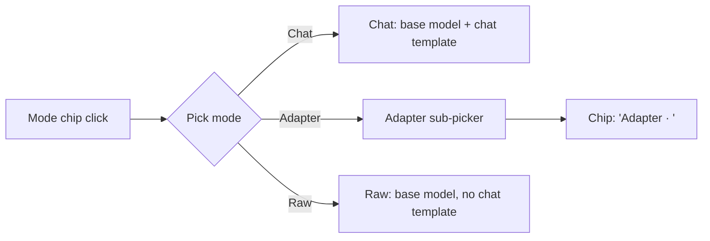

# LoRA Hub UX — Composer spec

This document locks in the composer design for v1. It replaces the single
line in `PLAN.md` that referenced "adapter dropdown next to message input."

## Composer anatomy

```
┌────────────────────────────────────────────────────┐
│ [Mode: Chat ▾]   write your message...             │  ← input row
│                                                    │
│ +                                                  │  ← attach affordance
└────────────────────────────────────────────────────┘
  [Base: Llama-3.1-8B-Instruct Q4 ▾]                    ← lower bar
```

Four regions:

- **Mode chip** — inline at the start of the input row. Always visible.
- **Text area** — free-form prompt entry to the right of the chip.
- **`+` attach** — bottom-left of the input row. Reserved affordance.
- **Lower bar** — below the input container. Currently holds a single
  base-model selector; reserved space to its right for future selectors
  (hardware backend, session switcher).

When the Adapter mode is active, the chip expands to include the
adapter's name:

```
[Mode: Adapter · SQL Gen ▾]   write your message...
```

## Mode chip

Three modes. Clicking the chip opens a menu:

| Mode      | Semantics                                                             |
|-----------|-----------------------------------------------------------------------|
| `Chat`    | Base model + standard chat template. No adapter. This is the default. |
| `Adapter` | Opens a sub-picker of installed adapters. Once an adapter is chosen, the chip renders as `Adapter · <name>`. Switching to a different adapter = clicking the chip again and re-picking. |
| `Raw`     | Base model, no chat template (completions-style). For power users.    |

Mode-selection flow:



## Per-message semantics

The mode and adapter shown on the chip apply to the **next** send only.
The transcript stores the mode/adapter per turn, so every assistant reply
is permanently tagged with the mode that produced it. A reader scrolling
a long conversation can see at a glance which turn used which adapter.

This carries Phase 2's "per-message adapter selection" goal for free:
changing the chip between turns is exactly per-message selection. No UI
change will be required when Phase 2 arrives — only the caching and
compatibility-check work in the runtime.

## `+` attach button

Reserved affordance. File and image attachments are **not** in v1 scope.
The button ships in the layout, disabled, with a tooltip ("Attachments
coming soon") so that when attachments land the composer's spatial
balance does not shift. Keeping the slot visible now prevents a later
layout churn that would retrain user muscle memory.

## Lower bar

One control in v1:

- **Base model selector** — dropdown listing installed base models (the
  one the app auto-downloaded plus any user-added). Switching here
  reloads the base and clears the adapter cache; adapter
  compatibility is enforced by base SHA (see `PLAN.md`, Phase 2 risks).

The bar reserves space to the right for future selectors. Candidates
noted but not scheduled for v1:

- Hardware-backend selector (MLX / CPU fallback / future CUDA).
- Session switcher (for users who juggle multiple in-flight conversations).

## Deferred (explicitly not v1)

- **Secondary chip under the input** for generation settings or adapter
  blend / strength. Kept out because it would compete visually with the
  mode chip; generation settings continue to live in the settings panel
  behind the gear icon.
- **Multi-adapter stacking** within a single turn. Phase 2+ territory.
- **Session switcher in the lower bar**. Deferred until multiple
  simultaneous sessions are actually a supported mental model.

## Rationale — why an inline chip beats a dropdown

1. **Visual tie to the message being composed.** The chip lives in the
   same row as the text area, so the active adapter reads as a
   property of *this* message rather than a global app setting
   someone forgot to change.
2. **Per-message swaps feel like editing the chip.** When Phase 2 lets
   users change adapter per turn, the affordance already looks like a
   per-turn control. A sidebar dropdown would have needed a redesign
   to signal that its scope had changed.
3. **Legible transcripts.** With mode stored per turn and displayed on
   each reply, a reader can re-orient in a long conversation without
   toggling anything — the chip label under each assistant turn is
   self-documenting.
